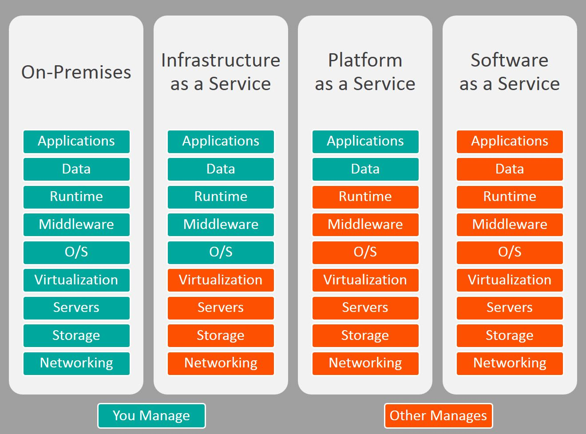
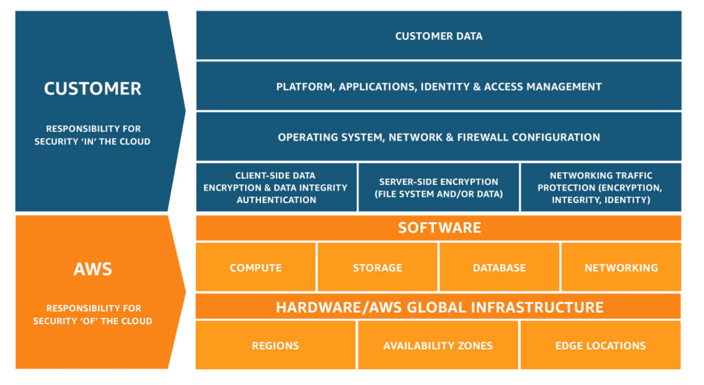
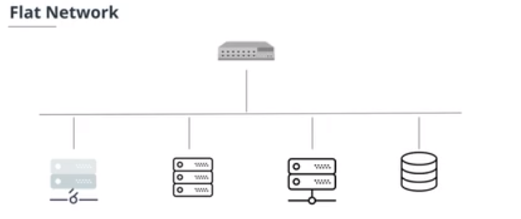

- [Cloud fundamentals](#cloud-fundamentals)
  - [Cloud computing](#cloud-computing)
    - [What is it?](#what-is-it)
    - [Types](#types)
    - [Deployment models](#deployment-models)
    - [Benefits](#benefits)
    - [Providers](#providers)
    - [Global infrastructure](#global-infrastructure)
    - [Shared responsibility](#shared-responsibility)
    - [Udacity AWS student account](#udacity-aws-student-account)
  - [Foundational & Compute Service](#foundational--compute-service)
    - [Intro](#intro)
    - [EC2 (Elastic Cloud Compute)](#ec2-elastic-cloud-compute)
    - [EBS (Elastic BLock Storage)](#ebs-elastic-block-storage)
    - [VPC](#vpc)
    - [Classless Inter-Domain Routing (CRID)](#classless-inter-domain-routing-crid)
    - [Exercise: Launch EC2 with EBS inside a VPC](#exercise-launch-ec2-with-ebs-inside-a-vpc)
    - [Lambda](#lambda)
    - [Exercise: Lambda function triggered by S3 bucket upload](#exercise-lambda-function-triggered-by-s3-bucket-upload)
    - [Elastic Beanstalk](#elastic-beanstalk)
  - [Storage & content delivery](#storage--content-delivery)
    - [Storage in the cloud](#storage-in-the-cloud)
    - [S3](#s3)
    - [DynamoDB](#dynamodb)
    - [RDS](#rds)
    - [RedShift](#redshift)
    - [Cloudfront = Content Delivery Network (CDN)](#cloudfront--content-delivery-network-cdn)
  - [Security](#security)
    - [Why?](#why)
    - [AWS WAF](#aws-waf)
    - [Shield](#shield)
    - [IAM](#iam)
  - [Networking & Elasticity](#networking--elasticity)
    - [DNS](#dns)
    - [Rout 53](#rout-53)
    - [Elasticity](#elasticity)
    - [EC2 autoscaling](#ec2-autoscaling)
    - [Elastic Load Balancer (ELB)](#elastic-load-balancer-elb)
    - [Exercise: Launch two EC2 instances and an ELB](#exercise-launch-two-ec2-instances-and-an-elb)
  - [Messaging & Containers](#messaging--containers)
    - [Simple Notification Service (SNS)](#simple-notification-service-sns)
    - [Simple Queue Service (SQS)](#simple-queue-service-sqs)
    - [Elastic Container Service (ECS)](#elastic-container-service-ecs)
  - [AWS Management](#aws-management)
  - [PROJECT: deploy static website on AWS](#project-deploy-static-website-on-aws)

# Cloud fundamentals

## Cloud computing

### What is it?

Cloud computing provides...

- databases
- compute power
- applications
- security

It is characterized by...

- pay as you go = pay only for what you use
- autoscaling = growing/shrinking on demand, no guess about demand
- serverless = not tight to any specific server, provider manages it for you

### Types

There are three types of cloud computing: IaaS, PaaS and SaaS:


Examples for each type

- IaaS = AWS, Digital Ocean, Ragspace, ...
- PaaS = GoDaddy, Salesforces
- SaaS = GMail, Office365

### Deployment models

- public cloud = e.g. AWS
- private cloud = on-premise, internal data center (cloud?)
- hybrid cloud = combination of on-premise and cloud (e.g. store sensitive data on-premise and everything else in public cloud)

### Benefits

You can innovate quickly because...

- no capital investment upfront
- scale quickly
- go global in minutes with short latency times

### Providers

- AWS
- GCP
- Azure
- ...

### Global infrastructure

AWS provides

- "Regions" = geopgraphic location
  - pick nearest for low latency
  - services are always tied to a specific region (unless setup otherwise)
- "Availability Zone" = a physical datacenter within each region
- Edge location = mini datacenter only used for caching static content

### Shared responsibility

- AWS provides security OF the cloud
- Customer provides security IN the cloud



### Udacity AWS student account

- only use region us-east-1 (N.Virginia) or us-east-2 (Ohio)
- budget only 25$ now?!

Also recommended: [VSCode AWS Toolkit](https://aws.amazon.com/visualstudiocode/)

- create resources
- debug serverless applications
- deploy services to AWS

After installing you need to...

- AWS: Create credentials profile (see below)
- AWS: Connect to AWS

```conf
# credentials file showing a Default profile
[default]
aws_access_key_id=*****
aws_secret_access_key=*******
aws_session_token=***********************
# config file
[default]
region = us-east-1
output = json
```

Once we have a **permanent** access key via AWS IAM, we should delete `aws_session_token`.

## Foundational & Compute Service

### Intro

Provision a server in the cloud for a static website

### EC2 (Elastic Cloud Compute)

Exercise where we set one up.

### EBS (Elastic BLock Storage)

A physical hard drive mounted in an EC2 instance

two types of memory:

- instance store
- EBS
  - **persists** after EC2 shuts down
  - is replicated across AZ
  - can specify different types
  - can also be attached later to running instance

### VPC

Why?

- allows you to define a virtual network with public or private facing subnets
- this limits what you expose to the public and thereby enhances security!

Contrast to flat network


VPC...

- lives within a region
- spans across multiple AZs

- Your **VPCs** - It will list all your VPCs and display the deep-dive details of the selected VPC. Each VPC has a valid IPv4/IPv6 CIDR block allocated to it. Every resource in the VPC will have an IP address from the allocated CIDR block. Though, a few IP addresses reserved for special purposes.
- **Subnets** - It represents a subset of your VPC, i.e., a range of IP addresses from the CIDR block allocated to your VPC. Subnets of a VPC can be present in different AZs.
- **Route tables** - These are the set of rules, called routes, that determine to which IP address the network traffic should be directed.
- **Internet gateways** - If any of your resources within your VPC wants to communicate to the internet, then you must attach an internet gateway to your VPC. The internet gateway enables the communication between resources in your VPC and the internet.
- **Network access list** - set of firewall ruless for controlling in- and outcoming traffic

### Classless Inter-Domain Routing (CRID)

original address definition

- first 8 bits of 32bit IPv4 address represented network number, which specified the network the host was attached to.
- remaining 24bits were local addresses ("hosts") within that network
- -> Only ~255 global networks, does not scale!

Class**ful** network in 1981

- main idea: allow more global networks
- if 32bit IPv4 address..
  - starts with 0, then network number defined by first 8 bits, leaving 24 bits for host (Class A)
  - starts with 10, then network number defined by first 16 bits, leaving 16 bits for hosts (Class B)
  - starts with 110, then network number defined by first 24 bits, leaving 8 bits for hosts (Class C)
  - ....
  - -> in total

Subnetting

- divide a network into a subnetwork
- benefits
  - allocates address space efficiently
  - may enhance routing efficiency
  - administrative changes
- HOWEVER, this does not give more addresses, or?!
  

Class**less** inter-domain routing in 1993

- uses variable lenght subnets
- {IP-address}/{network prefix length}
- Example
  - 198.51.100.14/24 represents...
    - network prefix = 198.51.100.xxx
    - equivalently subnet mask of 255.255.255.0
    - host .014 in that network

### Exercise: Launch EC2 with EBS inside a VPC

duh...

### Lambda

- run code in the cloud without provisioning a server
- time limit of 15min (previously 5min)
- triggered by events (e.g. upload by )
- author code locally or directly via lambda console
- supports many languages (node.js, python, go, ...) as well as custom runtimes
- billed by milliseconds !

### Exercise: Lambda function triggered by S3 bucket upload

okay, easy to setup

### Elastic Beanstalk

Elastic Beanstalk...
- is used to deploy web applications to the cloud more quickly
- can spin up many AWS services like...
  - EC2
  - auto-scaling
  - elastic load balancer
  - database
  - VPC
  - security groups
- can deploy web applications to those servers in many languages (Java, Python, Docker, ...)


## Storage & content delivery

### Storage in the cloud

Important features are
- durability
- availability
- scalability

### S3 

S3 buckets...
- live in a region
- must have a globally unique name
- can be used for...
  - static website hocing
  - data backups
  - ...

### DynamoDB

DynamoDB...
- is a NoSQL database
- can scale quickly
- can deal with large amounts
- is fully managed (hardware, configuration, software paching, cluster scaling)

NoSQL databases...
- are schema less and therefore very flexible (too flexible?)
- store data in json
- each row in a table is a document
- each item consists of (key, value and value type)

### RDS

Relational Database Service...
- is fully managed by AWS (see above)
- supports Oracle, PostgreSQL, MySQL, Aurora (AWS specific)

> Your request to create DB cluster database-1-cg-20220510-instance-1 didn't work. User: arn:aws:sts::008678026353:assumed-role/voclabs/user1961240=10802959683 is not authorized to perform: rds:CreateDBCluster on resource: arn:aws:rds:us-east-1:008678026353:cluster:database-1-cg-20220510 with an explicit deny in an identity-based policy

### RedShift

- **datawarehouse** service
- used for e.g. historical data - whereas relational database used for current data
- uses columnar format instead of row format
- optimized for fast queries and big data volume

### Cloudfront = Content Delivery Network (CDN)

A Content Delivery Network (or CDN) speeds up delivery of your static and dynamic web content by *caching* content in an Edge Location close to your user base.

Cloudfront...
- is the AWS service for a CDN
- can be configured for e.g. caching an S3 bucket
- origin = source

## Security

### Why?

- secure data, especially personally identifiable information (PII)
- protect data, applications and cloud hardware

### AWS WAF

- web application firewall
- controls ingoing and outgoing traffic
- prevents
  - SQL injection
  - cross-site scripting

### Shield

- prevents against DDoS-Attacks (Distributed Denial of Service)
- standard shield is always running !
- advanced shield is a paid service (to e.g. view threat-event statistics)

### IAM

- Identity & Access Management
- strive for "least privileged access"
- in particular, do not use root account for everyday work, but instead setup a new role
- also setup multi factor authentification (MFA) for your root account

IAM distinguishes between
- IAM User = person or service
  - has dentials**permanent** username and access credenticals
- IAM Group = collection of person
- IAM Role = role/identity which can be attached to a user (also temporarily).
  - There are many predefined roles.
  - A role has no cre
- IAM Policy = granular permission which can be attached to users, groups and roles. Is defined in `json`.
- EC2 security group = **Not a part of IAM**, but associated with an EC2 instance. Act as a built-in firewall.

Difference beetween IAM user and IAM role ([SO-post](https://stackoverflow.com/questions/46199680/difference-between-iam-role-and-iam-user-in-aws)):
- users are used for authentification (who are you?)
- roles are used for authorization (are you allowed to do this?)
- only users have a password and an access key

AWS supports three different role types:
- attached to services (e.g. EC2)
- attached to users from other AWS accounts
- attached to users authentificated by a trusted external system
  - web-based identity such as facebook, google
  - IAM support integration via OpenID Connect - SAML 2.0 such as Active Directory and LDAP

## Networking & Elasticity

### DNS

Domain Name System (DNS)
- allows to route http://www.google.com to http://74.25.21.147 
- is a decentralized database
- sidenote: IPv4 addresses have already been depleted since ~2011.
  
How does DNS *resolution* work? (resolution = conversion of hostname to IP-address)
- local computer asks nearby DNS server for www.test.example.com
- If DNS server hasn't cached answer already, it...
  - asks root domain `.` to find out the addresses of the nameservers for `.com` (root domain server is always configured!)
  - asks any `.com` nameserver to find nameservers for `example.com`
  - asks any nameserver `example.com` to find nameservers responsible for `test.example.com`
  - asks any nameserver `test.example.com` for IP-address of `www.test.example.com`
  - Final nameserver looksup IP-address and returns it to client
    - sidenote: New systems seem to prefer returning IPv6 addresses over IPv4 addresses. This can be configured [on the client side](https://askubuntu.com/a/38468)

### Rout 53

- is Cloud DNS service
- has DNS servers around the globe
- scales automatically to manage spikes in DNS queries
- allows you to register a domain name (or manage an existing)
- routes internet traffic to the resources for your domain
- Allows *DNS failover*:
  - checks health of resource
  - if resources is unavailable, routes to different IP-address

### Elasticity

Scaling...
- has the biggest benefit of
  - not needing guessing demand
  - not under- or overutilizing in-premise servers
- can happen
  - vertical = choose a big instance
  - horizontal = chosse more instances of same type

### EC2 autoscaling

- scales EC2 instances based on your conditions
- works with AWS message services like simple notification service (SNS) to alert you of events (e.g. scale up or down)

*AWS autoscaling*
- is different than EC2 autoscaling!
- works with other services such as DynamoDB

Autoscaling Group requires to define...
- desired instance count
- EC2 launch template 
- scaling policy to define WHEN to scale

### Elastic Load Balancer (ELB)

- stands *in front of* a web server
- balances load between two or more servers
- provides redundancy and performance
- it can add more servers?! Not sure...
- works with
  - EC2 instances
  - containers
  - IP-addresses
  - Lambda functions
- comes as 
  - Application Load Balancer (HTTPs)
    - can parse HTTP request and route based on that
  - Network Load Balancer (TCP/UDP)
    - can only analyze TCP packet

Example:
- two running EC2 instances (NOT in autoscaling)
- ELB in front of them

### Exercise: Launch two EC2 instances and an ELB

Notes:
- HTTPS vs. HTTP
  - HTTPS uses TLS (SSL) to encrypt HTTP requests and response
  - When a client opens a HTTPS website, the server shares the public key is shared with the client. Using this key, they aggree on session keys, which are used to encrypt any subsequent communication.
  - configuring SSL may be a bit tricky on the amazon linux 2 AMI, see https://docs.aws.amazon.com/AWSEC2/latest/UserGuide/SSL-on-amazon-linux-2.html
  - 

echo "<?php phpinfo(); ?>" > /var/www/html/phpinfo.php
echo "<? echo Welcome to server 2>" > /var/www/html/phpinfo.php


## Messaging & Containers

### Simple Notification Service (SNS)

- typically occurs between internet-based applications and devices (from system to system)
- decouples notification logic from your App
- uses publish/subscribe model and **topics**
- Possible subscribers are
  - Person
  - Other AWS services
  - mobile push
  - text messages
  - Email
- Message are processed in a queue (FIFO) - asynchronously

### Simple Queue Service (SQS)

- managed queue service
- send, store and receive messages
- two types of queues
  - FIFO (exactly once and in exact order)
  - standard ("best-effort-ordering"?)


### Elastic Container Service (ECS)

## AWS Management

## PROJECT: deploy static website on AWS
